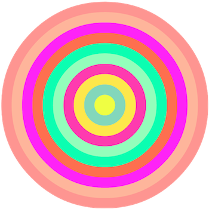
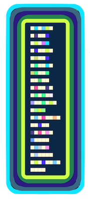
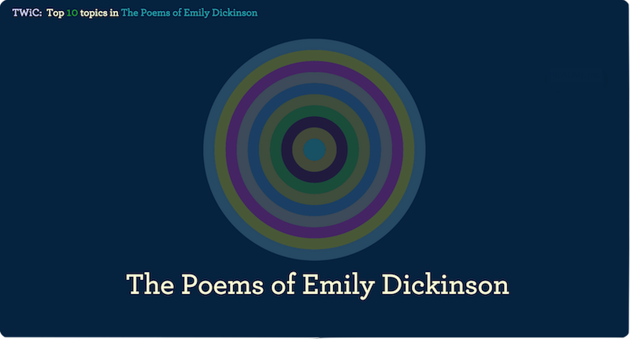
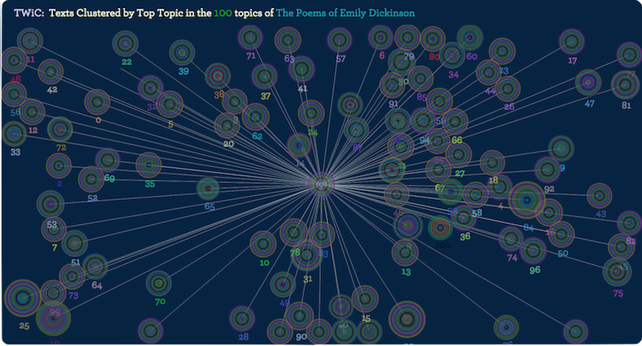
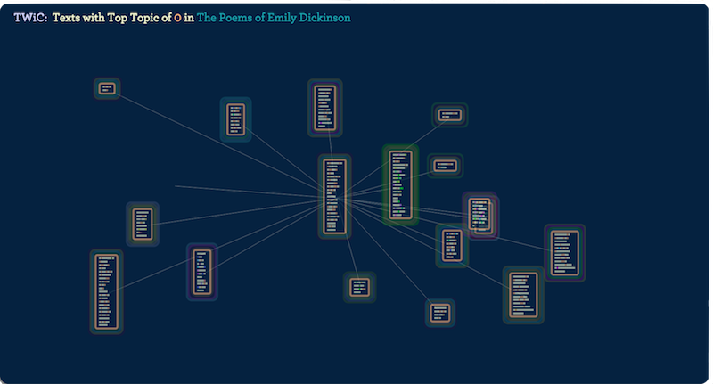
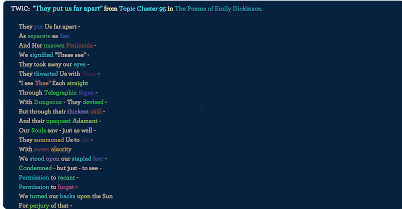
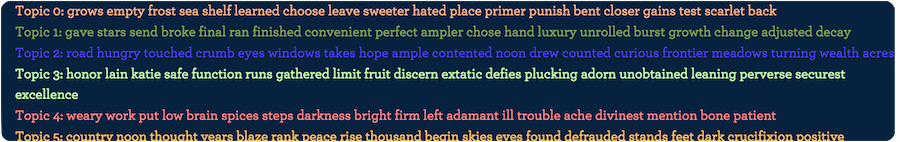

 
 
**T**opic **W**ords **i**n **C**ontext
 
 
 
Table of Contents
 
**1.** [**Overview**](#overview)
 
**--**&nbsp;&nbsp;[**Data Shapes**](#datashapes)
 
**--**&nbsp;&nbsp;[**Panels**](#panels)
 
**2.** [**How to Use**](#howtouse)
 
 
 

<a name="overview" style="text-decoration:none; color:black;">Overview</a>
 
 
Thanks for trying out **"Topic Words in Context"** - or **"TWiC"**, for short.
 
TWiC is a data visualization created by [Jonathan Armoza](http://www.twitter.com/jonathangrams) that provides hierarchical, top-down and bottom-up views of LDA topic models generated by the popular topic modeler, [MALLET](http://mallet.cs.umass.edu).
 
TWiC was born out of the need for digital humanities researchers to understand how the topic word list outputs from topic modelers like MALLET relate to the texts they attempt to model.
 
In order to do so, the visualization presents users with multiple, related views that portray how topics are distributed throughout the entire collection of texts being modeled, looking from all the way above - the "big data" view - and diving downward to where topic words are situated in their original contexts in the texts themselves. Each successive view as one browses the visualization is then considered part of the larger whole of the previous view, or to put it another way, a subset of texts "underneath" the previous view.
 
 
 
<a name="datashapes" style="text-decoration:none; color:black;">Data Shapes</a>
 
 
Topic Bullseyes
 
<table border="0" align="center"><tr><td></td></tr></table>

 
Above is one of the primary means by which topic distribution is visualized in TWiC: a bullseye-like abstraction of the top N topics of the texts being represented. In the image above, this would represent the top 10 topics of a group of texts. Each ring represents a topic and is given a randomly assigned and unique color. Moving inward from the outside of the shape toward the center, more significant topics are represented, until one arrives at the center, or, the top topic.

 
 
Topic Rectangles
 
<table border="0" align="center"><tr><td></td></tr></table>

 
The other primary shape in TWiC is the topic rectangle, a shape that utilizes the same paradigm as the topic bullseye, where outer rings (in this case, outer rectangles) represent the top N topics of an individual text. In the image above, this would represent the top 5 topics of one text. At the center of the topic rectangle is a miniature, programmatically-derived (and truncated) view of the text itself and its topic words, each word represented by colored squares among the initial lines of the text. Uncolored words (in a light goldenrod) are words that have been ignored by MALLET.

 
 
 
<a name="panels" style="text-decoration:none; color:black;">Panels</a>
 
 

TWiC presents users with a research environment for examining topic models that consists of several graphical and informational panels. Graphical panels present TWiC's data shapes and their relationships to one another in the model and context of the collection. Informational panels show metadata about those shapes, like the topic word lists themselves and their proportions throughout the various views/levels of the collection. Graphical panels also reveal information about each other as well. With several on the screen, by mousing over data shapes and double-clicking to open underlying views, the user can not only understand the distribution of topics at a particular viewing height in the collection, but also the relation between the topic distribution as seen in those two or more vantages.

 
 

Graphical Panels
 
 
The Corpus View
 
 
<table border="0" align="center"><tr><td></td></tr><tr><td align="center">**The top 10 corpus-level topics of "The Poems of Emily Dickinson"**</td></tr></table>

 
 
The Corpus Cluster View
 
 
<table border="0" align="center"><tr><td></td></tr><tr><td align="center">**Texts clustered by their top topic and seen as topic bullseyes. Each bullseye is placed at a distance from the corpus's average topic distribution**</td></tr></table>

 
 
The Text Cluster View
 
 

<table border="0" align="center"><tr><td></td></tr><tr><td align="center">**An example of texts/topic rectangles as viewed underneath a corpus cluster's topic bullseye. Each text is set at a distance from the cluster's average topic distribution.**</td></tr></table>

 
 
The Individual Text View
 
 

<table border="0" align="center"><tr><td></td></tr><tr><td align="center">**A text as selected and viewed from the previous text cluster panel**</td></tr></table>

 
 
Informational Panels
 
 

 
The Topic Bar
 
 
<table border="0" align="center"><tr><td></td></tr><tr><td align="center">**Displays and highlights all topic word lists of the model**</td></tr></table>
 
 
 
<a name="howtouse" style="text-decoration:none; color:black;">How to Use</a>
 
 

**Follow the steps below to try out the current version of TWiC that browses the poems of Emily Dickinson**
  
Steps
 
**1.** Download and unzip TWiC's [master zip file](https://github.com/jarmoza/twic/archive/master.zip) and place in the directory where you would like run the visualization.
 
**2.** Insert your corpus (in .txt file form, preferably chunked up to 1000 words or so) into the twic/data/input/txt/ directory
 
**3.** Run the python script in code/py/general: twic_corpus2vis.py with the argument "mi"
 
**--a.** Alter the number of topics or intervals in twic_corpus2vis.py if you want
 
**4.** Browse to the same directory via your terminal (or command line) application and type the following command without quotes.
 
**-- For Python 2 users:** "python -m SimpleHTTPServer 8080"
 
**-- For Python 3 users:** "python3 -m http.server 8080"
 
**If you don't know your current Python version, first try:** "python --version" 
**5.** Open your web browser (TWiC is currently best supported by [Google Chrome](http://www.google.com/chrome/)) and enter the following into the address bar without quotes: "localhost:8080/twic.html"
 
 
 
**More descriptive readme and version to browse your own corpus's topics, soon to follow!**

